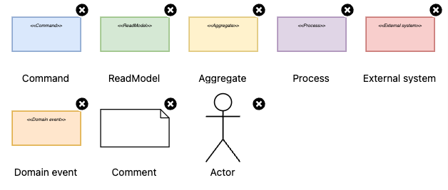

# Drawio event storming

Library for event storming in draw.io

## How to use
1. In draw.io: File -> Open Library from -> URL...
2. Put this link in modal window: https://raw.githubusercontent.com/egor-spk/drawio-event-storming/master/EventStorming.xml
3. Enjoy!